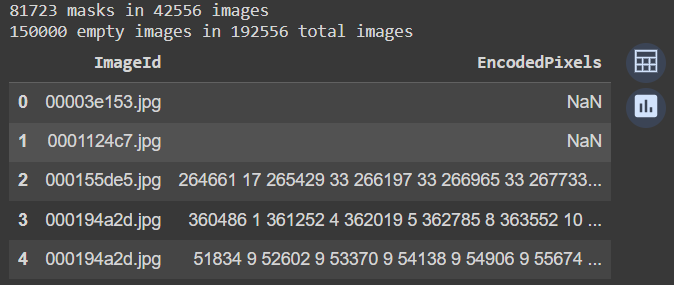
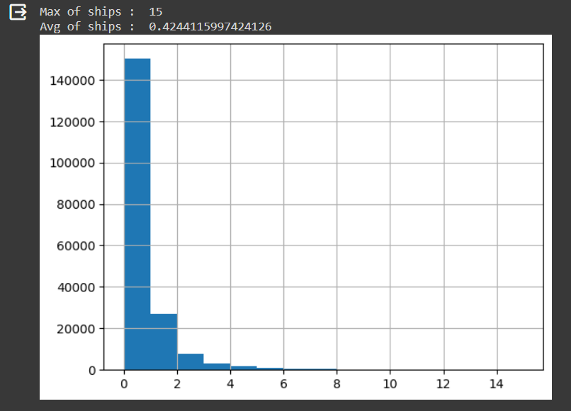
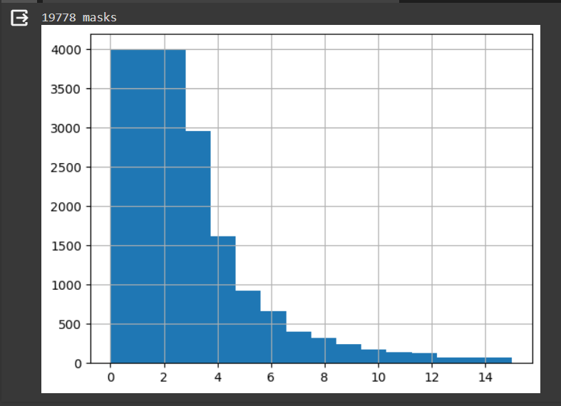
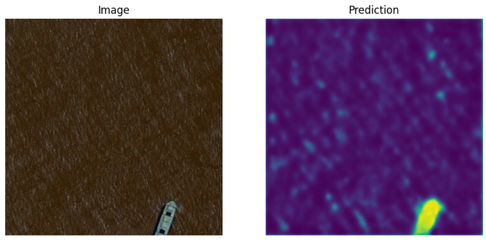
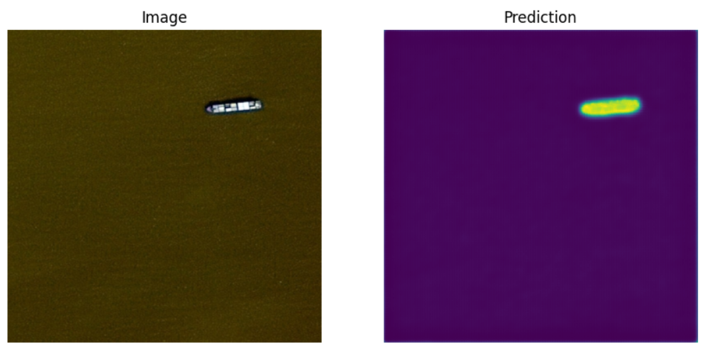
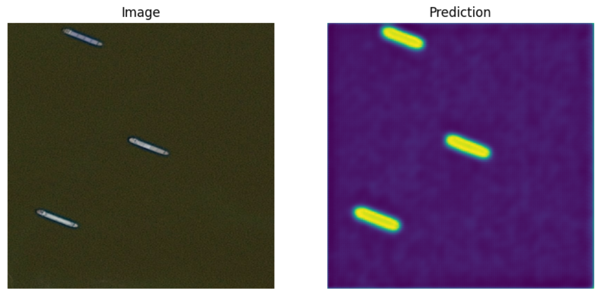

# Airbus-Ship-Detection
Solution to Airbus Ship Detection from the Kaggle platform: https://www.kaggle.com/c/airbus-ship-detection/overview

## EDA
All EDA is done in main.ipynb - which is recommended to get familiar with in the first place.

#### Dataset is consisted of two folders of train (train_v2/) images, test images (test_v2/), and masks (train_ship_segmentations_v2.csv).

As turned out, this dataset has a lot of empty images (where no ship is to be found). Also, the number of masks is greater than the number of non-empty images, which indicates that on single images there could be multiple ships (each has its own mask instance).
- 150000 empty images in 192556 total images
```python
masks = pd.read_csv(os.path.join(BASE_DIR, 'train_ship_segmentations_v2.csv'))
not_empty = pd.notna(masks.EncodedPixels)
print(not_empty.sum(), 'masks in', masks[not_empty].ImageId.nunique(), 'images')
print((~not_empty).sum(), 'empty images in', masks.ImageId.nunique(), 'total images')
masks.head()
```
 

As mentioned above, this data has one major class - empty image. By making another column to mask Dataframe, grouping it by each image instance, and sum its masks we can see how each group (number of ships on one image) is distributed.
After plotting the histogram of distribution we can see that this dataset is highly unbalanced. This can cause an overfitting. This is because the model's objective is often to minimize the overall error, and if one class has more instances, the model may focus more on correctly predicting the majority class while neglecting the minority class. Resampling is preferred in this situation.

```python
masks['ships'] = masks['EncodedPixels'].map(lambda c_row: 1 if isinstance(c_row, str) else 0)
unique_img_ids = masks.groupby('ImageId').agg({'ships': 'sum'}).reset_index()
unique_img_ids['has_ship'] = unique_img_ids['ships'].map(lambda x: 1.0 if x>0 else 0.0)
masks.drop(['ships'], axis=1, inplace=True)
unique_img_ids['ships'].hist(bins=unique_img_ids['ships'].max())
print('Max of ships : ',unique_img_ids['ships'].max())
print('Avg of ships : ',unique_img_ids['ships'].mean())
```

 

In the cell below, we undersample groups by 4000 instances so each group will have a maximum of 4000 examples. After resampling, the dataset will be more balanced and more resistant to overfitting. Also, volume of data is highly reduced which will speed up our training process.

```python
SAMPLES_PER_GROUP = 4000
balanced_train_df = unique_img_ids.groupby('ships').apply(lambda x: x.sample(SAMPLES_PER_GROUP) if len(x) > SAMPLES_PER_GROUP else x)
balanced_train_df['ships'].hist(bins=balanced_train_df['ships'].max()+1)
print(balanced_train_df.shape[0], 'masks')
```
 

## Architecture
- Architecture: UNet
- Loss function: FocalLoss
- Optimizer: Adam (lr=1e-3, decay=1e-6)
- learning scheduler: ReduceLROnPlateau(factor=0.5, patience=3)

## Results
Example 1:  
Example 2: 
Example 3: 
Example 4: 
